# What is the Curious Sample Planner?

The Curious Sample Planner (CSP) is an algorithm for flexibly and efficiently discovering temporally extended multi-step plans in sparse-reward environments. Complex behaviors such as cleaning a kitchen, organizing a drawer, or cooking a meal require plans that are a combination of low-level geometric manipulation and high-level action sequencing. Below are a few of the tasks that we are looking to find planning solutions to.

	

		<h3 class = "block_title">Block-Stacking</h3>
		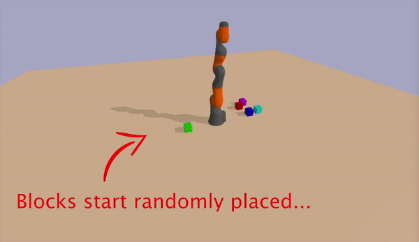
	

	

		<h3 class = "block_title">Ramp-Building</h3>
		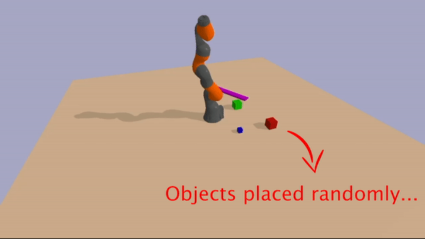
	

	

		<h3 class = "block_title">Tool-Construction</h3>
		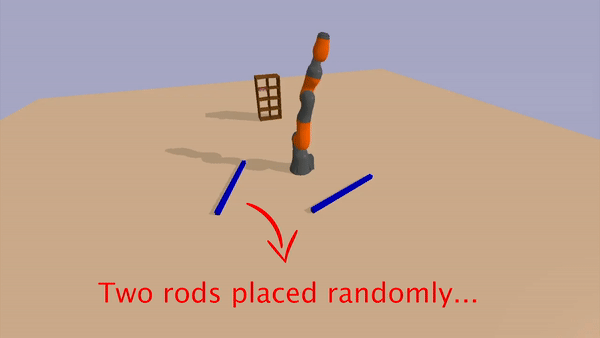
	

	

		<h3 class = "block_title">Pulley-Seesaw</h3>
		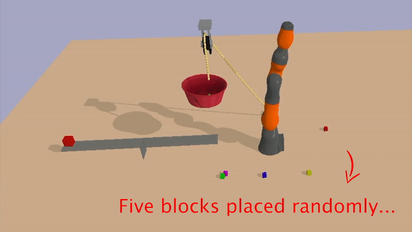
	

The agent is only given a reward after having completed the **entire** task. In any one of these tasks, if the agent randomly explored it's configuration space (as is the case in initial RL policies), it would be highly improbable that it would ever pick up a single block, and would therefore receieve no reward as a reinforcement signal. 

	

		<h3 class = "block_title">Random Exploration</h3>
		
	

Even if it was able to pick up a single block and place it on another object, it would need to repeat that several more times without knocking over the tower in order to recieve a single reward. A solution to this type of problem needs to somehow self-discover a very specific chain of low-probability actions in order to reach the goal with no reinforcement signal or distance-to-goal metric.

# Long-Range Planning Tasks

We aimed to create tasks that require temporally extended planning as well as low-level geometric manipulation. We constructed a suite of tasks with that objective in mind, and implemented those tasks using a modification of the [Pybullet-planning Library](https://github.com/caelan/ss-pybullet)

### Block-Stack

In this task, the robot is provided with a set of cubic blocks, and the robot's goal is to stack the blocks in a stable tower (in no particular order), but the robot is not provided with any reward at intermediate unsolved conditions. Block stacking is a commonly used task for evaluating planning algorithms because it requires detailed motor control and has a goal that is sparse in the state space.

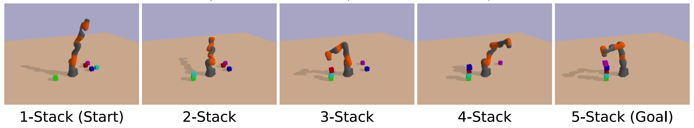

### Push-Away

In this task, the robot is provided with several large cubic blocks, a flat elongated block, and one additional smaller target object that can be of variable shape (e.g. a cube or a sphere). The objective is to somehow push the target object outside the directly reachable radius of the robotic arm. Depending on the situation, the solution to the task can be very simple or quite complex. For example, if the target object is cubic with high friction, it may be necessary for the robot to discover how to make construct a very steep ramp, such that dropping the object on it can roll it out of reach.

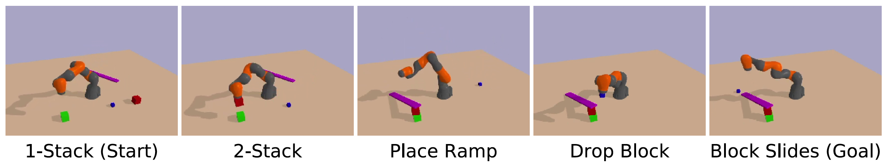

### Bookshelf

In this task, the environment contains a bookshelf with a single book on it. 
The robot is also provided with two elongated rectangular-prism rods initially placed at random (reachable) locations in the environment. The goal is to knock the book off the bookshelf. However, the book and bookshelf are not only outside the reachable radius of the arm, but they are further than the combined length of the arm and a single rod. However, the robot can solve the task by combining the two rods in an end-to-end configuration using the link macro-action, and then using the combined object to dislodge the book.

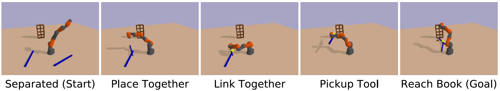

### Launch-Block

In this task, the environment contains a rope-and-pulley with one end of the rope connected to an anchor block on the floor and the other attached to a bucket that is suspended in mid-air. A seesaw balances evenly below the bucket, with a target block on the far end of the seesaw. The goal is to launch this target block into the air, above the seesaw surface. The robot could solve this task by gathering all blocks into the bucket and untying the anchor knot so that the bucket will descend onto the near end of the seesaw. However, due to the masses of the blocks and the friction in the seesaw, this can only happen when all five blocks are used.

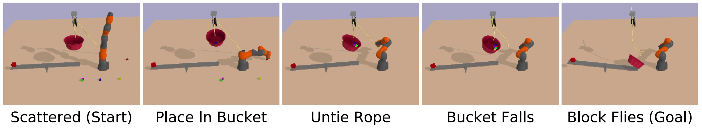

# Existing approaches

Currently, there are three approaches to problems of this sort: geometric motion planning, task and motion planning, and reinforcement learning. Unfortunately, these methods have problems that make them unusable for complex physical tasks that we were looking to solve with a flexible, multi-purpose algorithm.

### Reinforcement Learning Restrictions

Our first attempt might be trying to use reinforcement learning on action primitives such as joint torques where a reward of 1 is given for having stacked the blocks or built the ramp and 0 otherwise. Unfortunately, the randomly initialized reinforcement learning policy would lead the arm to randomly explore its configuration space and likely never even pick up a single block. 

### Geometric Motion Planning Restrictions

Now let's say we were to try geometric motion planning, which effectively explores the entire configuration space of primitives. The configuration space, in this case, includes dimensions for the rotation and position of each of the objects in addition to the robotic joint configurations. Such a large dimensional continuous configuration space is impossible to search exhaustively. 

### Task and Motion Planning Restrictions

Finally, let's say we wanted to use task and motion planning for such a problem. While task and motion planning solves problems similar to this in constrained geometric settings, how would you configure the logical predicates necessary for describing the effect of dropping a plank on a tower of blocks or rolling a ball down a ramp? 

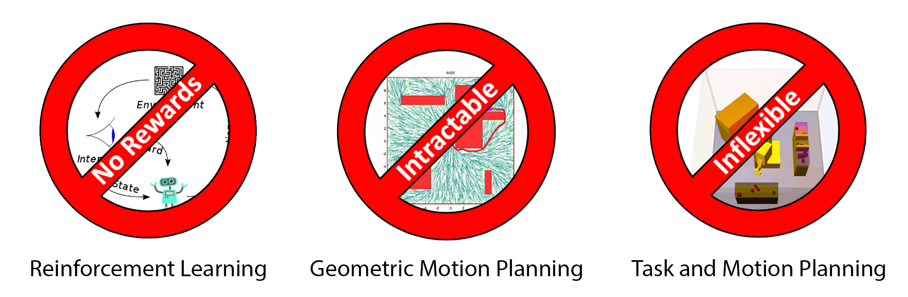
	
To avoid these problems, we combine the strengths of deep reinforcement learning and task and motion planning to create an algorithm that can flexibly and efficiently find solutions to long-range planning problems through curious exploration. 

First, we will take a look at some of the types of problems we are trying to solve.

# How does CSP Work?

At its core, CSP is an algorithm for efficiently building a search tree over the state space using parameterized macro-actions which prioritizes exploration of novel states.

CSP is comprised of four main modules. The action selection networks include an actor-network and a critic-network, which learn to select macro-actions and choose parameters of that macro-action given a particular state.

The action selection networks have two primary functions: maximizing curiosity in action selection and avoiding infeasible macro-actions. The networks are trained using actor-critic reinforcement learning. The networks select feasible actions that maximize the novelty signal, leading to actions that result in novel configurations or dynamics. The actor-network outputs a continuous (real-valued) vector which is translated into a macro-action with both discrete and continuous parameters. The forward dynamics module takes a state and an action primitive simulates forward a fixed time and returns the resulting state. This forward dynamics module is used by a geometric planning module to convert macro-actions into feasible sequences of motor primitives. 
Finally, the curiosity module is a neural network that takes states as inputs and returns a curiosity score, with learnable parameters.

# What can CSP do?

In the process of planning, CSP discovers interesting solutions to complex problems, discovering the construction and use of tools and simple machines.  

A video illustrating some representative solutions can be found [here](https://youtu.be/7DSW8Dy9ADQ)

Sometimes CSP finds solutions that were unexpected and qualitatively different from those imagined by the authors.
As an example, we initially developed the Push-Away task with a spherical ball as a target object, hoping CSP would build a ramp and roll the ball out of the reachability zone. 
However, CSP instead found a simple solution consisting of aiming and dropping the ball precisely on the edge of another object, in order to get enough horizontal velocity to roll out of the reachability zone. 

In an attempt to avoid this rather trivial solution, we then switched out the ball for a block with a high coefficient of friction. Now, instead of always building a ramp, CSP sometimes made use of its link macro-action to fix the block to one end of the plank and orient it so that the block was held outside the reachability zone. Once the link macro-action was disabled, ramp-building behavior robustly emerged.

These examples show how CSP is not biased in the direction of any one solution by reward curricularization, but rather can discover many qualitatively distinct solutions to a single objective.

	

		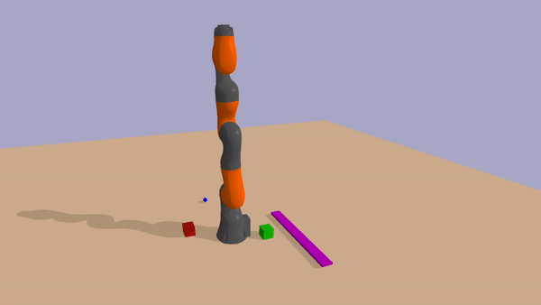
	

	

		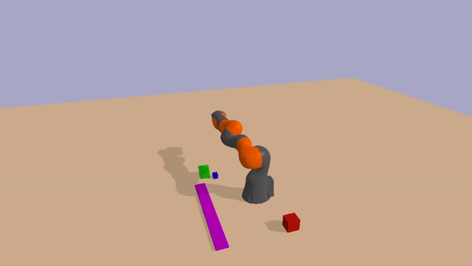
	

	

		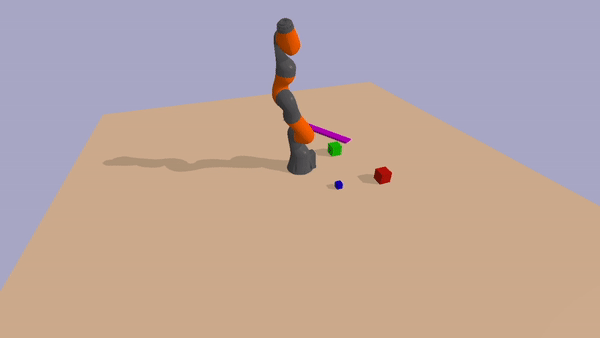
	

# Quantitative Results

We compared the performance of CSP to several reinforcement learning and planning baselines using a single metric: the number of steps taken in the environment.

* It is also important to note that it is impossible to compare our algorithm to TAMP because of the manual prespecification of action effects necessary for TAMP to function.

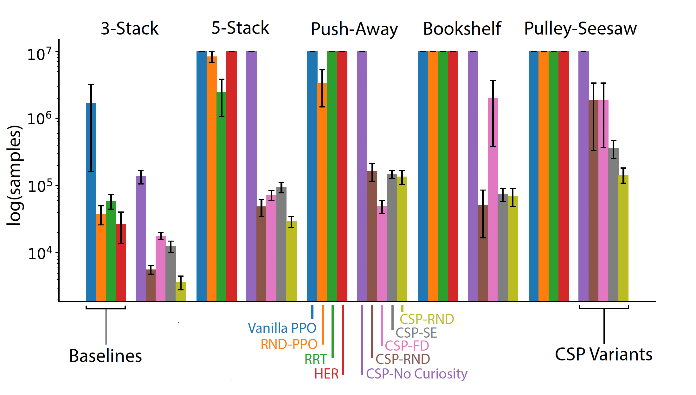

Overall, we found that CSP was dramatically more effective than the baselines at solving all four task types.
The control algorithms (including the CSP-No Curiosity baseline) were sometimes able to discover solution in the simplest cases (e.g. the 3-Block task).

However, they were substantially more variable in terms of the number of samples needed; and they largely failed to achieve solutions in more complex cases within a maximum sample limit.

The failure of the random and vanilla PPO/A2C baseliness is not surprising: the tasks we chose here are representative of the kind of long-range planning problems that typically are extremely difficult for standard DRL approaches.

# Why does CSP Work?

We can qualitatively compare the exploration patterns of different planning algorithms by examining the graphs generated during the planning process.  

The following figure gives an example of how multiple baseline algorithms explore the state space in comparison to CSP. While RRT (a geometric motion planning method) and random exploration are sometimes able to achieve two-block towers, they rarely progress to taller stacks because of the unlikeliness in the state space. On the other hand, because CSP biases the search toward unlikely states in the configuration space, tower configurations are oversampled and as a result, higher-stacked towers are explored.

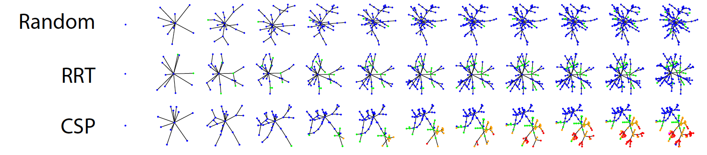

In the process of planning, CSP discovers interesting solutions to complex problems, discovering the construction and use of tools and simple machines.

We can also visualize some of the high-novelty nodes in the search tree that were not solutions. These nodes were heavily explored during the search process due to their novelty but didn’t lead to the goal. 

While these were not the goal state, they were reasonable avenues to explore in the process of finding the goal.

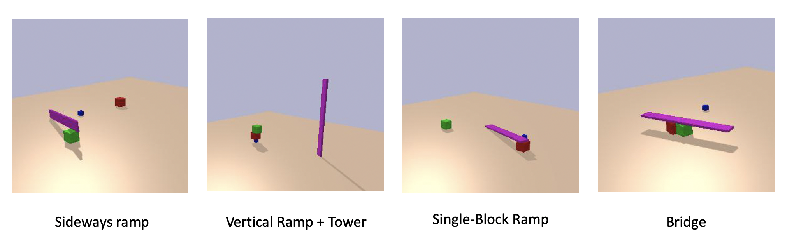

